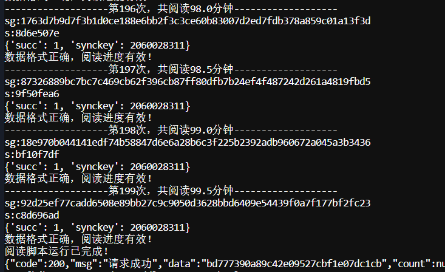
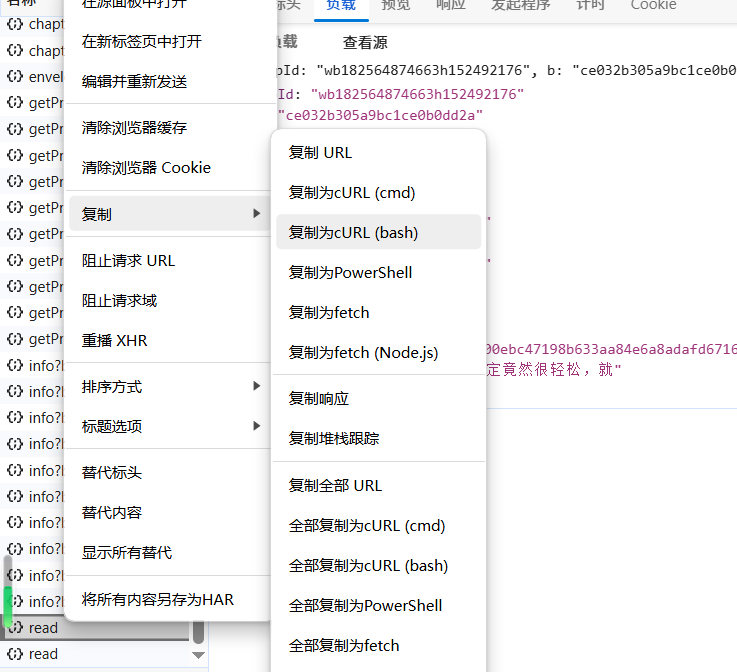
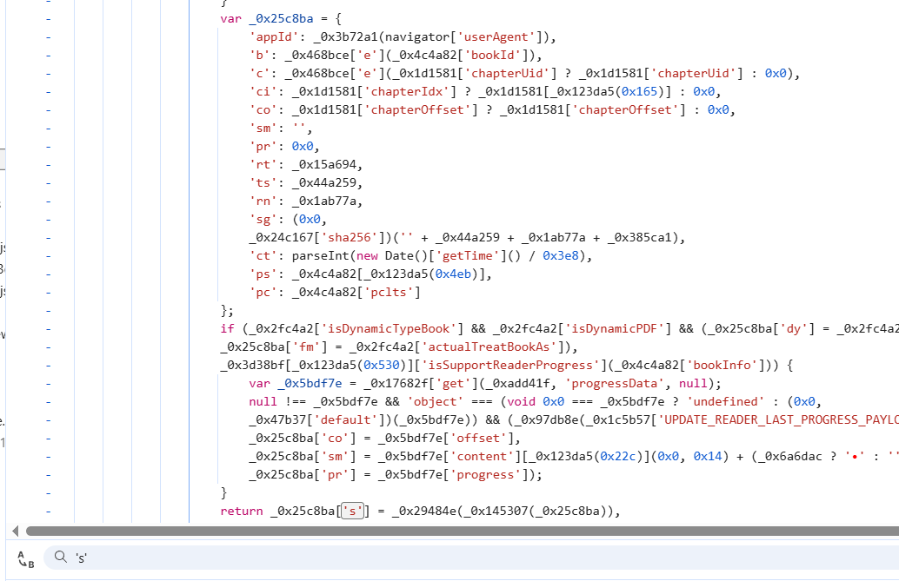
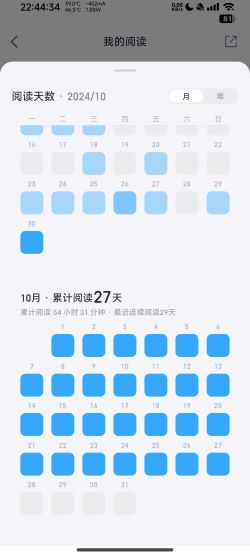
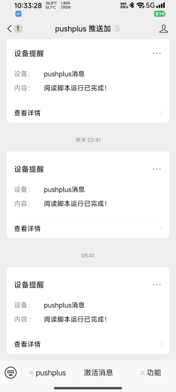

# 微信读书助手 Web 版

在原脚本的基础上搭建一个基于 Flask 的微信读书自动阅读 Web 管理系统。

## 项目介绍 📚

开发这个脚本的主要目的是为了在微信读书的阅读挑战赛中刷时长和天数。由于本人偶尔看书时未能及时签到，导致入场费打了水漂。网上找了一些，发现高赞的自动阅读需要挂虚拟器模拟或者用ADB模拟，实现一点也不优雅。因此，我决定编写一个自动化脚本。通过对官网接口的抓包和JS逆向分析，脚本能够解析各接口请求，分析字段拼接方式，并对字段进行加密和计算处理，确保服务器成功响应。

该脚本具备以下功能：

- **自动刷阅读时长**：默认计入排行榜和挑战赛，时长可调节，默认为60分钟。
- **定时运行**：可部署在服务器上，支持每天定时运行并推送结果到微信。
- **Cookie自动更新**：一次抓包后，脚本能自动获取并更新Cookie，支持长时间使用。
- **轻量化设计**：相比市面上的ADB调试器和自动阅读器，本脚本实现了轻量化的编写，部署服务器即可运行，无需额外环境条件。

## 功能特点 🌟

1. **Web 界面管理**
   - 用户注册和登录系统
   - 多配置管理
   - 实时状态监控
   - 任务历史记录

2. **自动阅读**
   - 自动刷阅读时长
   - 自动更新 Cookie
   - 支持自定义阅读时长
   - 实时进度显示

3. **定时任务**
   - 支持单次执行
   - 支持每日定时
   - 支持每周定时（可选择星期）
   - 定时任务状态监控

4. **消息推送**
   - 支持 PushPlus 推送
   - 支持 Telegram 推送
   - 任务执行状态通知
   - 错误信息推送

5. **系统监控**
   - 任务运行状态监控
   - 并发任务控制
   - 运行时间限制
   - 详细的日志记录

## 部署说明 🚀

### 1. 环境要求

- Python 3.8+
- MySQL 5.7+
- Linux/Windows 服务器

### 2. 抓包准备

在微信阅读官网 [微信读书](https://weread.qq.com/) 搜索【三体】点开阅读点击下一页进行抓包，抓到`read`接口 `https://weread.qq.com/web/book/read`，如果返回格式正常（如：

```json
{
  "succ": 1,
  "synckey": 564589834
}
```

右键复制为Bash格式，然后在 [Convert](https://curlconverter.com/python/) 转化为Python脚本，复制需要的headers与cookies字段，再启动Web端后创建配置，将复制的headers和cookies粘贴到相应的输入框。

### 3. 安装步骤

1. 安装依赖：

```bash
pip install -r requirements.txt
```

2. 配置数据库：

```bash
mysql -u root -p
# 在 MySQL 中执行：
CREATE DATABASE wxread DEFAULT CHARACTER SET utf8mb4 COLLATE utf8mb4_unicode_ci;
# 导入数据库结构
mysql -u root -p wxread < schema.sql
```

3. 修改配置：
   编辑 `config.py` 文件，设置数据库连接信息和其他配置项。

4. 启动服务：

```bash
python app.py
```

### 4. 使用说明

1. **添加配置**
   - 登录系统后点击"添加新配置"
   - 填写从微信读书网页版抓取的 Headers 和 Cookies
   - 设置阅读次数和推送方式

2. **设置定时任务**
   - 在配置卡片中点击"定时"按钮
   - 选择执行方式（单次/每日/每周）
   - 设置执行时间和日期（如果是每周）

3. **查看任务历史**
   - 点击导航栏的"任务历史"
   - 查看所有任务的执行记录
   - 可以查看详细的错误信息

4. **编辑配置**
   - 点击配置卡片中的"编辑"按钮
   - 修改阅读次数和推送设置
   - 保存更改后立即生效

## 注意事项 ⚠️

1. **Cookie 有效期**
   - Cookie 会定期失效，系统会自动尝试更新
   - 如果更新失败需要手动更新配置

2. **并发限制**
   - 默认最大并发任务数为 5
   - 超出限制的任务会被自动停止

3. **运行时间**
   - 单个任务最长运行时间为 2 小时
   - 超时任务会被自动终止

4. **定时任务**
   - 确保服务器时间准确
   - 单次任务执行后会自动清除调度

5. **签到次数调整**
   * 只需完成签到将`num`次数从120调整为2，每次`num`为30秒，200即100分钟。

6. **解决阅读时间问题**
   * 对于issue中提出的“阅读时间没有增加”，“增加时间与刷的时间不对等”建议替换`capture.py`中的【headers】、【cookies】字段。保留【data】字段。

***
## 字段解释 🔍

- `appId`: `"wbxxxxxxxxxxxxxxxxxxxxxxxx"` ✔️
  - 应用的唯一标识符。

- `b`: `"ce032b305a9bc1ce0b0dd2a"` ✔️
  - 书籍或章节的唯一标识符。

- `c`: `"0723244023c072b030ba601"` ✔️
  - 内容的唯一标识符，可能是页面或具体段落。

- `ci`: `60` ✔️
  - 章节或部分的索引。

- `co`: `336` ✔️
  - 内容的具体位置或页码。

- `sm`: `"[插图]威慑纪元61年，执剑人在一棵巨树"` ✔️
  - 当前阅读的内容描述或摘要。

- `pr`: `65` ✔️
  - 页码或段落索引。

- `rt`: `88` ✔️
  - 阅读时长或阅读进度。

- `ts`: `1727580815581` ✔️
  - 时间戳，表示请求发送的具体时间（毫秒级）。

- `rn`: `114`
  - 随机数或请求编号，用于标识唯一的请求。

- `sg`: `"bfdf7de2fe1673546ca079e2f02b79b937901ef789ed5ae16e7b43fb9e22e724"`
  - 安全签名，用于验证请求的合法性和完整性。

- `ct`: `1727580815` ✔️
  - 时间戳，表示请求发送的具体时间（秒级）。

- `ps`: `"xxxxxxxxxxxxxxxxxxxxxxxx"` ✔️
  - 用户标识符或会话标识符，用于追踪用户或会话。

- `pc`: `"xxxxxxxxxxxxxxxxxxxxxxxx"` ✔️
  - 设备标识符或客户端标识符，用于标识用户的设备或客户端。

- `s`: `"fadcb9de"`
  - 校验和或哈希值，用于验证请求数据的完整性。


***
## 截图展示 📸

#### 1. 运行结果



#### 2. 接口抓取



#### 3. JS逆向



#### 4. 显示成效（测试近一个月全部正常运行）



#### 5. 完成推送



1. - 

## 更新日志 📝

### v2.0.0 (2024-12-25)
- 添加 Web 界面管理功能
- 支持多用户和多配置
- 添加定时任务功能
- 添加任务历史记录
- 支持配置编辑功能
- 添加运行状态监控
- 优化推送功能

### v1.0.0 (2024-12-01)
- 基础自动阅读功能
- Cookie 自动更新
- 基础推送功能

## 问题反馈 💬

如果遇到问题或有建议，请提交 Issue。

## 免责声明 📢

本项目仅供学习交流使用，请勿用于商业用途。使用本项目产生的任何后果由使用者自行承担。
